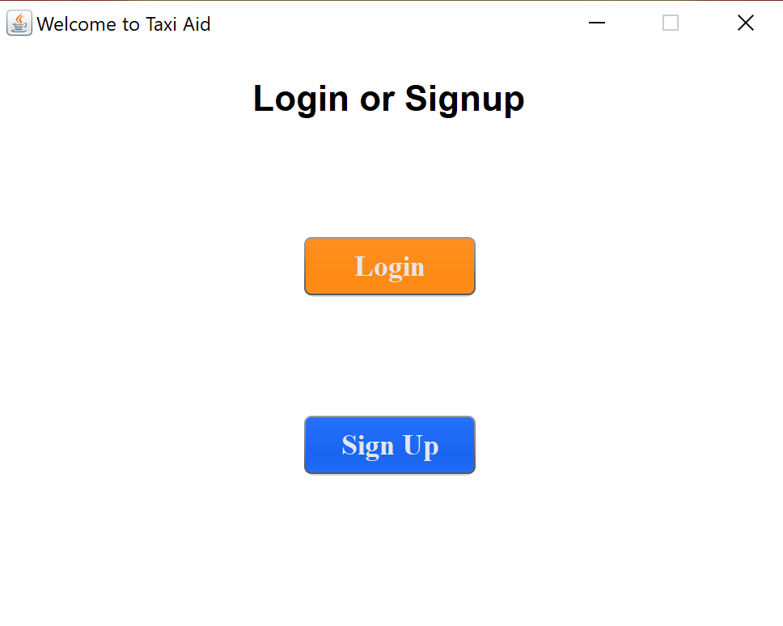
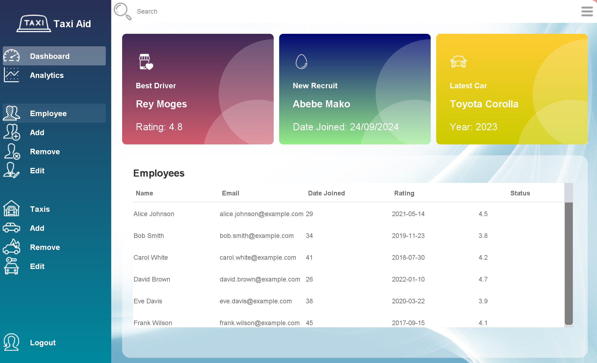
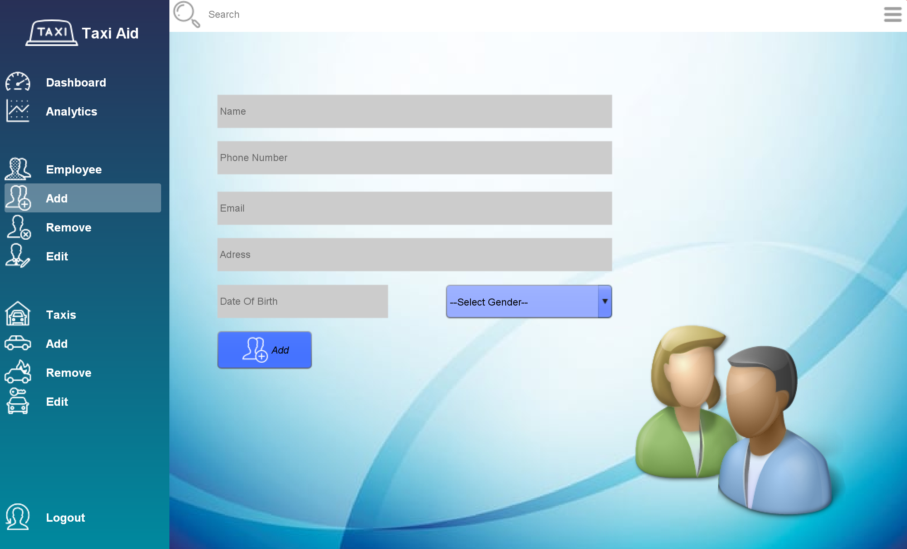
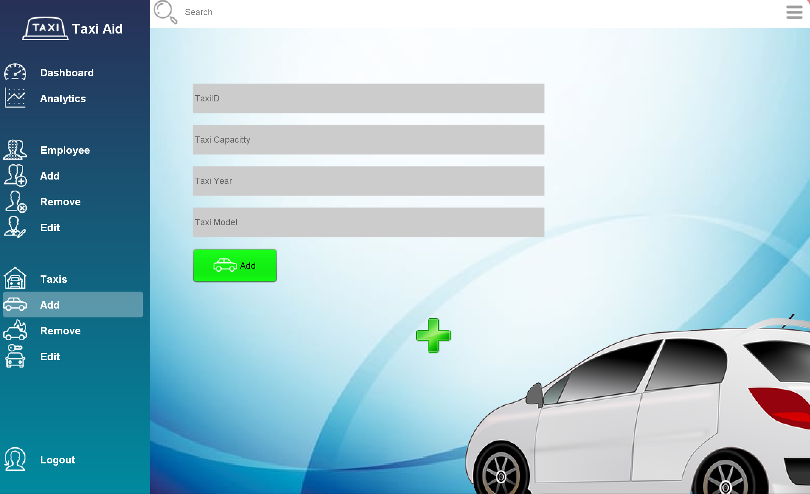
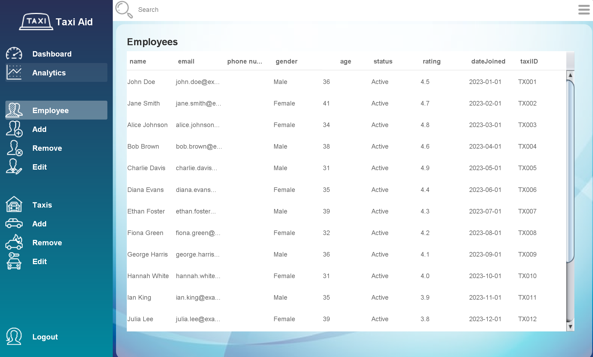
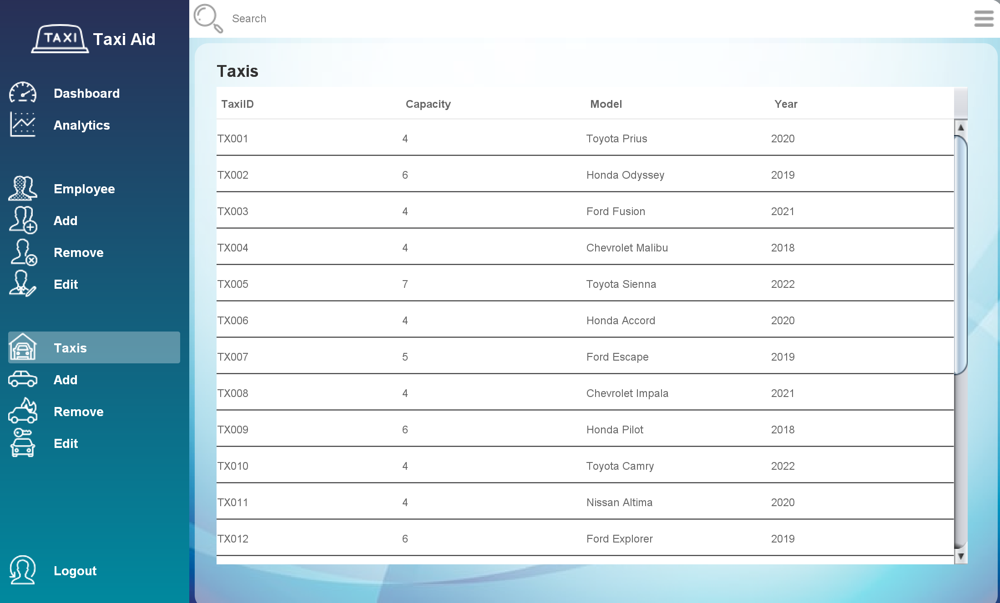

# Taxi Aid Management System

A desktop-based Taxi Management System developed using **Java Swing**. The application provides an intuitive graphical interface for managing taxi operations, including employee management, taxi management, bookings, analytics, and administrative functions.

This project demonstrates Object-Oriented Programming principles, Java Swing GUI development, input validation, and modular software design.

---

# Project Overview

Taxi Aid Management System is a desktop application designed to simplify the management of taxi services through an easy-to-use graphical interface.

The system allows administrators to:

- Manage employees
- Manage taxis
- Handle taxi bookings
- View analytics
- Validate user inputs
- Navigate through different management modules using an interactive dashboard

The project follows a modular architecture where different packages handle specific responsibilities.

---

# Features

## Taxi Management

- Add new taxis
- Edit taxi information
- Remove taxis
- View all registered taxis

---

## Employee Management

- Register employees
- Edit employee information
- Delete employees
- View employee records

---

## Booking System

- Create taxi bookings
- Booking interface using Java Swing
- Booking validation
- User-friendly booking window

---

## Dashboard & Analytics

The application provides a dashboard containing:

- Employee statistics
- Taxi information
- Navigation menu
- Analytics panel

---

## Input Validation

The system validates important user information including:

- Email addresses
- Phone numbers
- Taxi IDs

This helps prevent invalid data from entering the system.

---

## Modern Desktop Interface

Built entirely using Java Swing with:

- Custom panels
- Navigation sidebar
- Reusable UI components
- Dashboard cards
- Interactive forms

---

# Technologies Used

- Java
- Java Swing
- Object-Oriented Programming (OOP)
- Eclipse IDE
- Java Collections
- Event Handling
- Custom Swing Components

---

# Project Structure

```
JavaApplication2
│
├── src
│   │
│   ├── Cabb
│   │      Booking.java
│   │      Admins.java
│   │      Main.java
│   │      NewAdmins.java
│   │
│   ├── Employee
│   │      Employee.java
│   │      EmployeeService.java
│   │      EmployeeSQL.java
│   │
│   ├── Mainwindow
│   │      MainWindow.java
│   │
│   ├── Checker
│   │      EmailChecker.java
│   │      PhoneNumberChecker.java
│   │      TaxiIDChecker.java
│   │
│   ├── components
│   │      Header.java
│   │      Menu.java
│   │      Card.java
│   │
│   ├── form
│   │      FormHome.java
│   │      FormAnalytics.java
│   │      FormAddE.java
│   │      FormEditE.java
│   │      FormRemoveE.java
│   │      FormAddT.java
│   │      FormEditT.java
│   │      FormRemoveT.java
│   │
│   └── model
│
└── ...
```
---

# How to Run

## Clone the repository

```bash
git clone https://github.com/yourusername/TaxiAid-Management-System.git
```

---

## Open in Eclipse

1. Open Eclipse IDE
2. Select **Import Existing Java Project**
3. Choose the project folder
4. Finish the import

---

## Run the project

Run:

```
Main.java
```
or

```
MainWindow.java
```

depending on your project configuration.

---

# Object-Oriented Programming Concepts Used

This project demonstrates several OOP principles including:

### Classes and Objects

The system is organized into multiple Java classes responsible for different functionalities.

---

### Encapsulation

Employee, Taxi, and Booking data are managed through dedicated classes.

---

### Modular Programming

Packages are separated according to functionality:

- Employee
- Forms
- Components
- Validation
- Models

making the project easier to maintain and extend.

---

### Event Handling

Java Swing event listeners are used to respond to:

- Button clicks
- Mouse events
- Window events
- Keyboard events

---

# Application Modules

✔ Employee Management

✔ Taxi Management

✔ Booking System

✔ Analytics Dashboard

✔ Validation Utilities

✔ Administrative Functions

---

# 📸 Screenshots


## Login/Signup



---

## Dashboard



---

## Employee Management



---

## Taxi Management



---

## Registered Employees



---

##  Registered Taxis



---

# Future Improvements

Possible future enhancements include:

- Database integration
- User authentication
- Driver management
- Customer management
- Reports generation
- Payment integration
- Online booking
- Notifications
- Search and filtering
- Export reports to PDF

---

# Learning Outcomes

This project demonstrates practical experience with:

- Java Programming
- Swing GUI Development
- Event-Driven Programming
- Object-Oriented Design
- Input Validation
- Modular Software Architecture

---

# License

This project was developed for educational purposes.

Feel free to use this repository for learning and reference.

